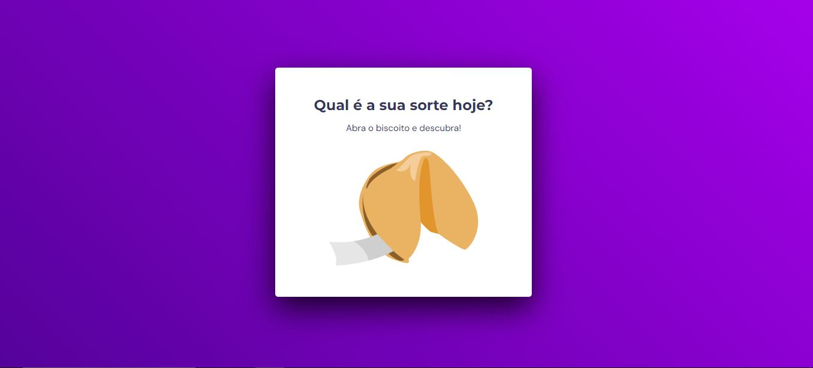

  

## 💻 Projeto
Esse é um projeto web ainda não responsivo desenvolvido durante o Stage 5 do Explorer da Rocketseat. Ele mostra uma frase do biscoito da sorte toda vez que o usuário realiza a ação de click ou pressiona enter.

## 🚀 Tecnologias
Esse projeto foi desenvolvido com as seguintes tecnologias:

- HTML
- CSS
- JavaScript
- Git e GitHub

## 🏷️ Link
Você pode vizualisar o layout do projeto através [deste link](https://biscoito-da-sorte-sigma.vercel.app/).